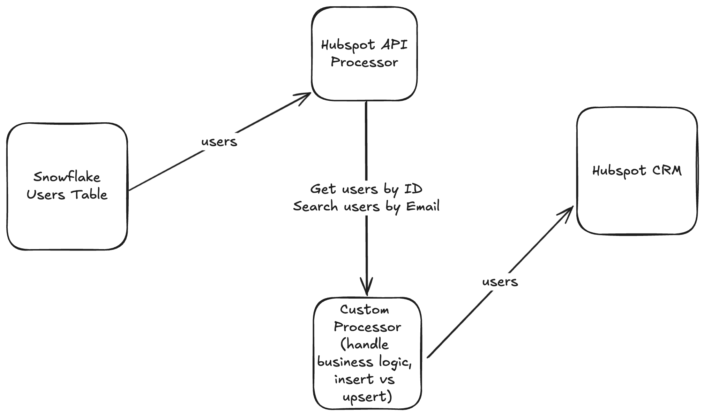

# Snowflake to HubSpot Reverse ETL Pipeline

## Overview

This project implements a reverse ETL (Extract, Transform, Load) pipeline that synchronizes user data from Snowflake to HubSpot. It's designed to replace Hightouch functionality by creating a custom solution for data synchronization between these two platforms.

## Pipeline Description

The pipeline performs the following steps:

1. **Data Extraction**: Connects to Snowflake and extracts user data from the specified table.
2. **Data Transformation**: Decodes JSON data from Snowflake and prepares it for HubSpot.
3. **HubSpot API Interaction**: 
   - Queries HubSpot by contact ID to check for existing users.
   - Searches HubSpot by email as a fallback method to identify existing users.
4. **Custom Logic**: Applies custom business rules to determine whether to create a new user or update an existing one in HubSpot.
5. **Data Loading**: Sends the processed data to HubSpot, either creating new contacts or updating existing ones.

## Key Features

- Bi-directional synchronization between Snowflake and HubSpot
- Intelligent handling of existing vs. new contacts in HubSpot
- Custom logic for data transformation and business rules
- Error handling and retry mechanisms
- Configurable via environment variables

## Prerequisites

- Access to a Snowflake database
- HubSpot API access token
- Environment variables set up for Snowflake and HubSpot credentials

## Configuration

The pipeline is configured using environment variables. Key variables include:

- `SNOWFLAKE_URL`: URL for the Snowflake instance
- `SNOWFLAKE_TABLE`: Name of the table containing user data
- `SNOWFLAKE_COLUMNS`: Columns to extract from Snowflake
- `HUBSPOT_ACCESS_TOKEN`: HubSpot API access token
- `HUBSPOT_BEARER_TOKEN`: Bearer token for HubSpot API authentication

## Usage

To run the pipeline:

1. Ensure all environment variables are set.
2. Execute the pipeline using your preferred orchestration tool.

## Pipeline Structure

The pipeline is defined in `pipelines/snowflake-to-hubspot.yaml` and consists of:

- A Snowflake source connector
- A HubSpot destination connector
- Multiple processors for data transformation and API interactions
- Custom logic for determining insert/update operations

## Customization

The `custom-logic` processor can be modified to implement specific business rules for data synchronization between Snowflake and HubSpot.
